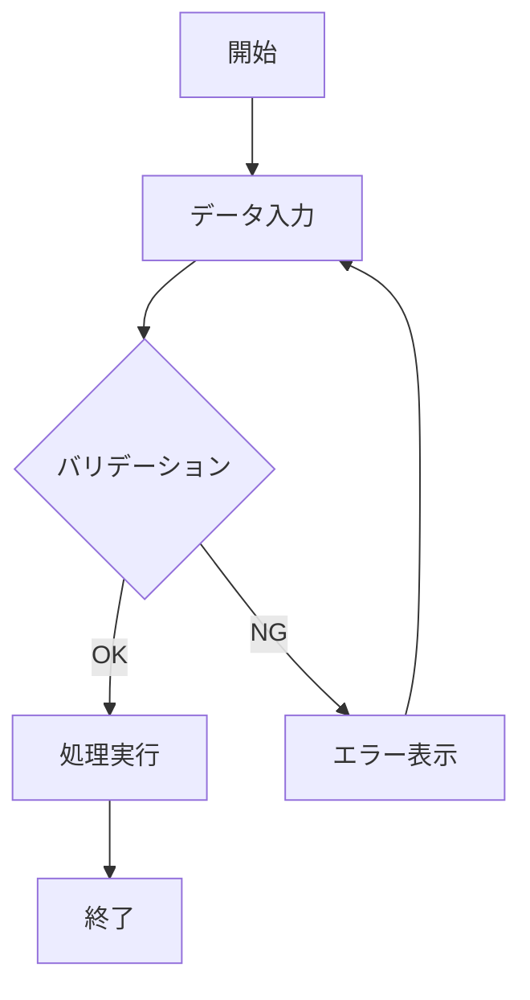
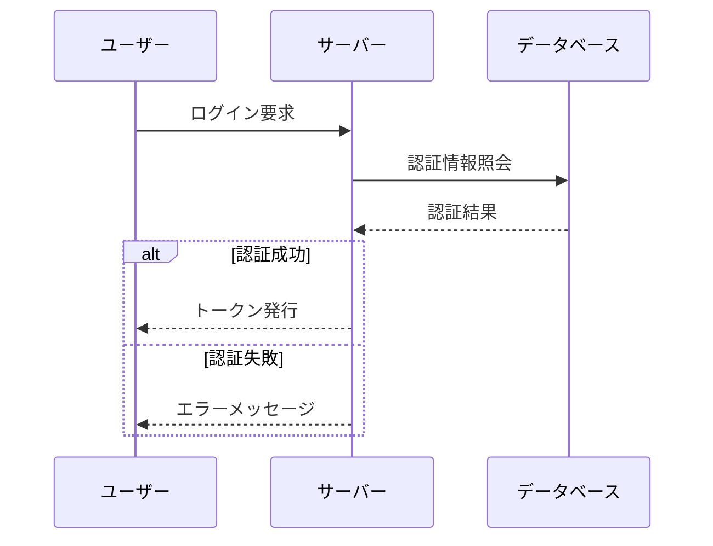
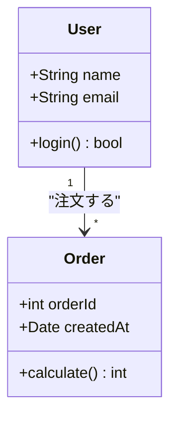
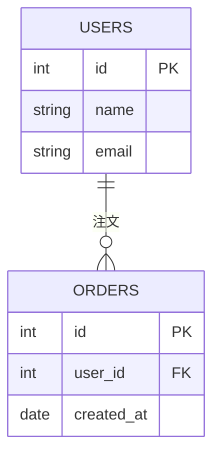
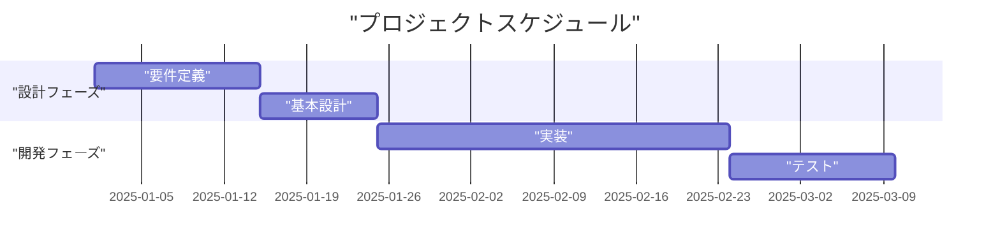
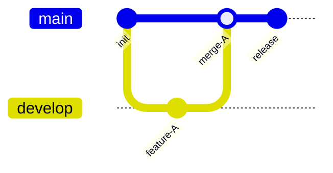
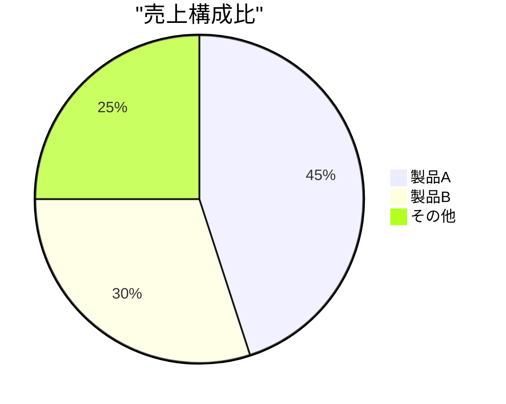
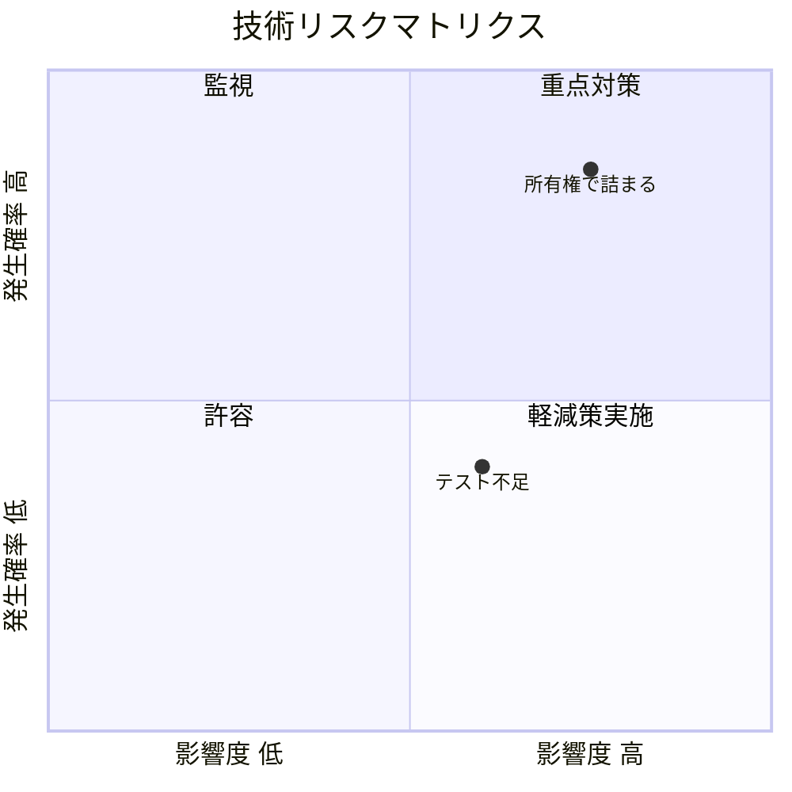
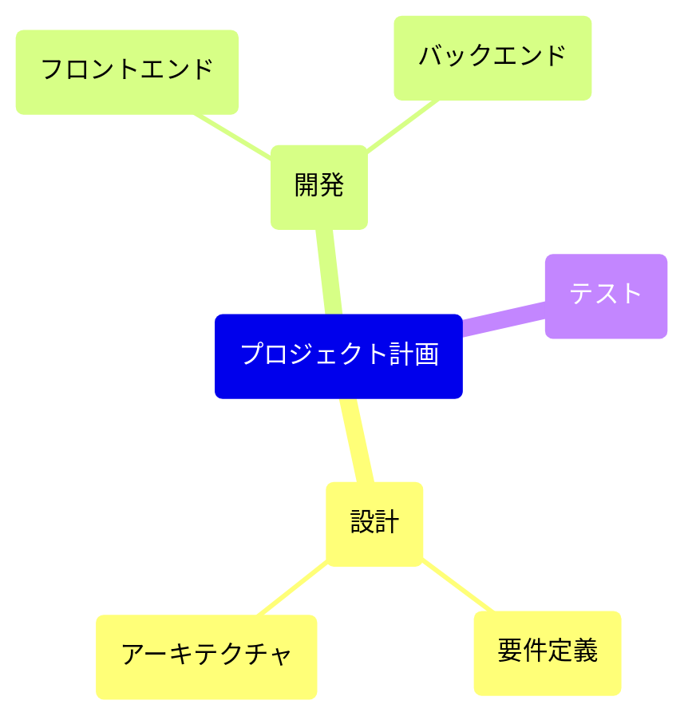

# Mermaid 図生成スキル

Mermaid コードブロックを生成する際に従うルール集。
目的は **パースエラーを出さず、一発で正しくレンダリングされる Mermaid コード** を書くこと。

---

## 出力形式

- Markdown のコードフェンス ````mermaid` ... ``` ` で出力する
- 図の種類は先頭行のキーワードで宣言する（`flowchart LR`, `sequenceDiagram`, `classDiagram` 等）

---

## 鉄則: 日本語・特殊文字を安全に扱う

Mermaid パーサーは記号をシンタックスとして解釈するため、ラベルに記号や日本語が混在すると壊れやすい。
以下のルールを **常に** 適用する。

### 1. ノードラベルは必ずダブルクォートで囲む

日本語や記号を含むかどうかに関わらず、全てのノードラベルをダブルクォートで囲む。
これが最もシンプルで安全なルール。

> **図の種類によるクォートルールの違い**
> - **Flowchart / State / Pie / Gantt / QuadrantChart**: 日本語テキストはダブルクォートで囲む
> - **Sequence Diagram**: メッセージ・エイリアス・条件テキストはクォート **しない**（クォートすると引用符がそのまま表示される）
> - **QuadrantChart は特に注意**: パーサーが `[A-Za-z]+` のみをテキストとして認識するため、日本語を含む軸ラベル・象限ラベル・ポイント名は **必ず** `"..."` で囲む。`title` 行のみ例外でクォート不要

```
✅ A["ユーザー入力"]
✅ B["処理(バリデーション)"]
✅ C["配列[0]の値"]
✅ D["設定{環境変数}"]

❌ A[ユーザー入力]
❌ B[処理(バリデーション)]     ← () がノード形状と衝突
❌ C[配列[0]の値]              ← [] がノード形状と衝突
```

**理由**: `()`, `[]`, `{}` はそれぞれ Mermaid のノード形状構文と衝突する。
ダブルクォートで囲めばリテラル文字列として扱われるため、一律クォートが最も安全。

### 2. エッジ（矢印）のラベルもダブルクォートで囲む

```
✅ A -->|"承認する"| B
✅ A -- "データ送信" --> B

❌ A -->|承認する| B        ← 日本語がパース失敗する場合がある
```

### 3. subgraph のタイトルもダブルクォートで囲む

```
✅ subgraph "認証フロー"
✅ subgraph "処理(メイン)"

❌ subgraph 認証フロー
```

### 4. 改行は `<br>` を使う（`\n` は使わない）

Mermaid ラベル内の改行は HTML タグを使う。バックスラッシュ n は改行として認識されない。

```
✅ A["一行目<br>二行目<br>三行目"]

❌ A["一行目\n二行目"]          ← \n は改行にならない
❌ A["一行目
二行目"]                        ← 生の改行はパースエラー
```

### 5. 特殊文字はエンティティコードでエスケープする

Mermaid 独自のエンティティ構文 `#name;` または `#decimal;` を使う（HTML エンティティ `&amp;` 形式ではない）。

| 文字 | エンティティコード | 説明 |
|------|-------------------|------|
| `&`  | `#amp;`           | アンパサンド |
| `"`  | `#quot;`          | ダブルクォート |
| `#`  | `#35;`            | ハッシュ |
| `;`  | `#59;`            | セミコロン（ラベル内に含めたい場合） |
| `♥`  | `#9829;`          | 10進数指定の例 |

```
✅ A["A #amp; B の比較"]
✅ B["A double quote: #quot;"]
✅ A->>B: I #9829; you!

❌ A["A & B の比較"]        ← パーサーが予期しない解釈をする可能性
```

> **注意**: 数値は10進数で指定する。HTML文字名（`#amp;` `#quot;` 等）もサポートされている。

### 6. セミコロン `;` をラベル内に書かない

Mermaid はセミコロンを文の終端として解釈する。ラベル内に含めると予期しない位置で文が切れる。
どうしても必要な場合は `#59;`（エンティティコード）または `；`（全角）で代替する。

### 7. "end" はそのまま使わない

フローチャートやシーケンス図で `end` という単語をノードのテキストに使うと、ブロック終端と解釈されて図が壊れる。
`"End"` のように大文字にするか、`["end"]` のようにクォートで囲む。

---

## 図の種類別ガイド

### Flowchart（フローチャート）



- 方向指定: `TD`（上→下）, `LR`（左→右）, `BT`, `RL`
- ノード形状: `["四角"]`, `("丸角")`, `{"ひし形"}`, `[/"平行四辺形"/]` 等
- 形状構文の中でもラベル部分はダブルクォートで囲む: `{"バリデーション"}` ではなく `{"\"バリデーション\""}` — ただし `{}` 形状の場合はクォートなしでも動くケースが多い。不安なら `{"バリデーション"}` で OK

### Sequence Diagram（シーケンス図）

シーケンス図はフローチャートとクォートのルールが異なる。
メッセージ（`: ` の後）、`as` エイリアス、`alt`/`loop` 等の条件テキストは **クォートしない**（クォートすると引用符がそのまま表示される）。



- `participant` / `actor` のエイリアスは `as 日本語名`（クォート不要）
- メッセージ（`: ` の後）はクォート不要（行末まで全てテキスト扱い）
- `alt` / `else` / `opt` / `loop` の条件テキストもクォート不要
- 改行は `<br/>` を使う（例: `Alice->>John: こんにちは<br/>お元気ですか？`）
- セミコロンをメッセージに含めたい場合は `#59;` を使う

### Class Diagram（クラス図）



- クラス名は ASCII を推奨（日本語クラス名はレンダラーによっては不安定）
- 関係ラベル（`: ` の後）はクォートで囲む

### ER Diagram（ER図）



- エンティティ名は ASCII を推奨
- 関係ラベルはクォートで囲む

### State Diagram（状態遷移図）

```mermaid
stateDiagram-v2
    [*] --> "待機中"
    "待機中" --> "処理中": "開始イベント"
    "処理中" --> "完了": "成功"
    "処理中" --> "エラー": "失敗"
    "エラー" --> "待機中": "リトライ"
    "完了" --> [*]
```

- 状態名に日本語を使う場合はクォートで囲む

### Gantt Chart（ガントチャート）



- タスク名・セクション名はクォートで囲む
- 日付フォーマットは英語（`YYYY-MM-DD`）

### Git Graph



- commit の `id` ラベルはクォートで囲む
- ブランチ名は ASCII のみ

### Pie Chart（円グラフ）



### QuadrantChart（象限チャート）

quadrantChart のパーサーは ASCII 英字 `[A-Za-z]+` のみをテキストトークンとして認識する。
日本語・記号を含むテキストはすべてダブルクォートで囲む。唯一 `title` 行だけは専用レキサールールがあるためクォート不要。



- `x-axis` / `y-axis`: ラベルはクォートで囲む。`-->` デリミタの前後にスペースを入れる
- `quadrant-1` 〜 `quadrant-4`: ラベルはクォートで囲む
- ポイント名: `"テキスト": [x, y]` の形式。クォート必須。x, y は 0〜1 の範囲
- `title`: クォート不要（専用のレキサールールで行末まで全てテキスト扱い）
- ASCII のみのテキスト（例: `Campaign A`）はクォートなしでも動作するが、統一のためクォート推奨

### Mind Map（マインドマップ）



- ルートノード・子ノードのラベルを `()` や `""` で囲む

---

## チェックリスト（生成後のセルフレビュー）

Mermaid コードブロックを書いたら、以下を確認する:

### Flowchart / State / Pie / Mind Map 系
1. [ ] ノードラベルがダブルクォートで囲まれているか（`["テキスト"]`, `{"テキスト"}`）
2. [ ] エッジラベル（`-->|"..."| ` や `-- "..." -->`）がクォートされているか
3. [ ] subgraph タイトルがクォートされているか
4. [ ] 改行に `<br>` を使っているか（`\n` は NG）
5. [ ] 特殊文字を `#name;` / `#decimal;` でエスケープしているか
6. [ ] セミコロンがラベル内に含まれていないか（`#59;` で代替）
7. [ ] `end` を小文字でノードテキストに使っていないか

### Sequence Diagram 系
8. [ ] メッセージ（`: ` の後）にクォートを付けて **いない** か
9. [ ] `as` エイリアスにクォートを付けて **いない** か
10. [ ] `alt`/`loop`/`opt` の条件にクォートを付けて **いない** か
11. [ ] 改行に `<br/>` を使っているか

### QuadrantChart 系
12. [ ] `x-axis` / `y-axis` のラベルがクォートで囲まれているか
13. [ ] `quadrant-1` 〜 `quadrant-4` のラベルがクォートで囲まれているか
14. [ ] ポイント名がクォートで囲まれているか（`"テキスト": [x, y]`）
15. [ ] `title` にはクォートを付けて **いない** か（付けても動くが不要）

### 共通
16. [ ] クラス名・エンティティ名・ブランチ名が ASCII か

---

## Markdown ドキュメント内での使い方

ドキュメントを作成・編集する際、以下のような場面では Mermaid 図を積極的に使う:

- **処理フロー・ワークフロー** → flowchart
- **システム間のやりとり** → sequenceDiagram
- **データ構造・DB設計** → erDiagram / classDiagram
- **状態の遷移** → stateDiagram-v2
- **スケジュール** → gantt
- **構成比・割合** → pie
- **概念の階層構造** → mindmap

図の前後に簡潔な説明文を添えると、図だけでは伝わらないコンテキストを補完できる。
