# Git ブランチ戦略・プッシュ戦略・工数見積もり

| 項目 | 内容 |
|------|------|
| 文書版数 | 1.0 |
| 作成日 | 2026-03-29 |
| 前提 | 実装計画書 v1.0 / 実装者: Rust 初心者（1 名） |

---

## 目次

1. [ブランチ戦略の選定](#1-ブランチ戦略の選定)
2. [ブランチ命名規則](#2-ブランチ命名規則)
3. [ブランチ運用フロー](#3-ブランチ運用フロー)
4. [プッシュ戦略](#4-プッシュ戦略)
5. [フェーズ別工数見積もり](#5-フェーズ別工数見積もり)
6. [全体スケジュール](#6-全体スケジュール)
7. [リスクと対策](#7-リスクと対策)

---

## 1. ブランチ戦略の選定

### 1.1 候補の比較

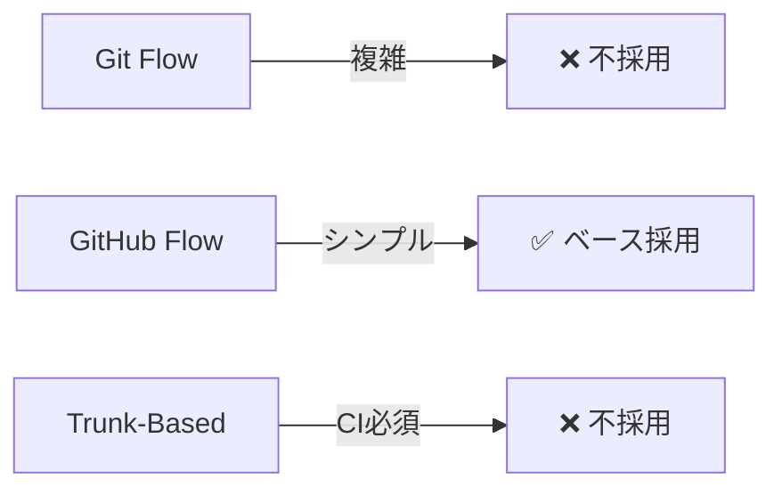

| 戦略 | メリット | デメリット | 本プロジェクトへの適性 |
|------|---------|-----------|---------------------|
| **Git Flow** | リリース管理が厳密 | develop/release/hotfix 等ブランチが多く複雑 | ❌ 1 人開発には過剰 |
| **GitHub Flow** | シンプル、main + feature branch のみ | リリース管理は別途必要 | ✅ **最適** |
| **Trunk-Based** | マージ地獄なし | CI/CD 必須、小さいコミット強制 | ❌ 初心者にはハードル高 |

### 1.2 採用戦略: **Phase Branch Flow**（GitHub Flow ベース）

本プロジェクトは **実装計画のフェーズ単位でブランチを切る** 戦略を採用する。

**理由:**

- 1 人開発のため、レビュー・承認フローは不要
- フェーズ = 機能単位のため、ブランチの粒度が明確
- 各フェーズ完了時に `main` へマージすることで、常に動く状態を `main` に保てる
- Rust 初心者のため「壊したら戻せる」安心感が重要

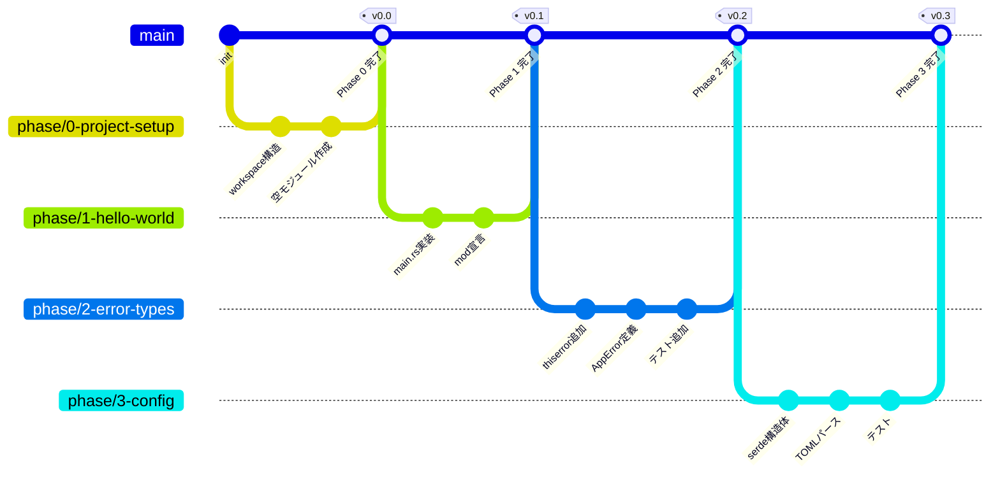

---

## 2. ブランチ命名規則

### 2.1 基本ルール

```
phase/<番号>-<英語の短い説明>
```

### 2.2 全ブランチ一覧

| Phase | ブランチ名 | 元ブランチ |
|-------|-----------|-----------|
| 0 | `phase/0-project-setup` | `main` |
| 1 | `phase/1-hello-world` | `main` |
| 2 | `phase/2-error-types` | `main` |
| 3 | `phase/3-config-loading` | `main` |
| 4 | `phase/4-cli` | `main` |
| 5 | `phase/5-validation` | `main` |
| 6 | `phase/6-placeholder` | `main` |
| 7 | `phase/7-file-watcher` | `main` |
| 8 | `phase/8-router-debounce` | `main` |
| 9 | `phase/9-action-copy` | `main` |
| 10 | `phase/10-action-move` | `main` |
| 11 | `phase/11-action-cmd-exec` | `main` |
| 12 | `phase/12-integration` | `main` |
| 13 | `phase/13-csv2toml` | `main` |
| 14 | `phase/14-final-testing` | `main` |

### 2.3 補助ブランチ（必要に応じて）

| 用途 | 命名 | 例 |
|------|------|----|
| バグ修正 | `fix/<対象>-<説明>` | `fix/config-parse-error` |
| ドキュメント | `doc/<説明>` | `doc/update-readme` |
| 手戻り・再実装 | `phase/<番号>-<説明>-v2` | `phase/5-validation-v2` |

---

## 3. ブランチ運用フロー

### 3.1 フェーズ単位のワークフロー

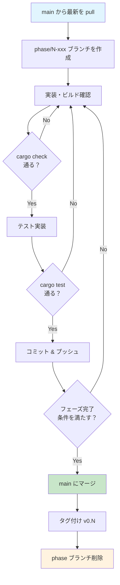

### 3.2 コミットメッセージ規約

```
<type>(<scope>): <description>

type:
  feat     - 新機能
  fix      - バグ修正
  test     - テスト追加・修正
  refactor - リファクタリング
  docs     - ドキュメント
  chore    - ビルド設定・依存追加等

scope:
  config, watcher, router, actions, placeholder, error, cli, csv2toml

例:
  feat(config): global.toml のデシリアライズ実装
  test(config): 必須項目欠落時のエラーテスト追加
  chore: serde, toml クレートを追加
```

### 3.3 マージ方針

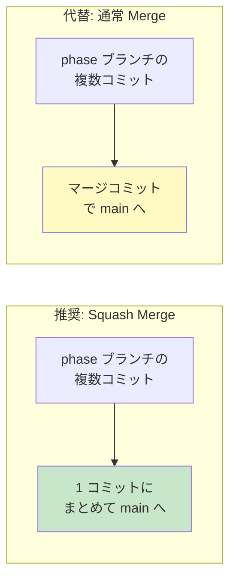

| 方式 | 使い分け |
|------|---------|
| **Squash Merge**（推奨） | フェーズ完了時。main の履歴がフェーズ単位でクリーンになる |
| **通常 Merge** | 途中経過を残したいフェーズ（Phase 12 等の大きなフェーズ） |

---

## 4. プッシュ戦略

### 4.1 プッシュのタイミング

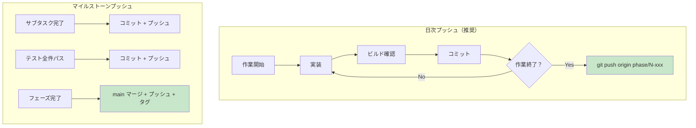

### 4.2 プッシュルール

| ルール | 内容 |
|--------|------|
| **日次バックアップ** | 作業終了時に必ず push（未完成でも OK） |
| **ビルド確認後** | `cargo check` が通らないコードは push しない |
| **main へのプッシュ** | マージ完了 + タグ付け後にのみ push |
| **force push** | phase ブランチでは許可（自分専用）/ main では **禁止** |

### 4.3 タグ戦略

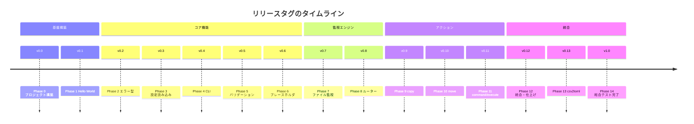

---

## 5. フェーズ別工数見積もり

### 5.1 見積もり前提

| 項目 | 前提条件 |
|------|---------|
| 実装者 | 1 名（Rust 初心者） |
| 1 日の作業時間 | 4〜6 時間（学習時間含む） |
| 見積もり単位 | 人日（学習 + 実装 + テスト + デバッグの合計） |
| バッファ | 各フェーズに不確実性に応じた係数を適用 |

### 5.2 フェーズ別内訳

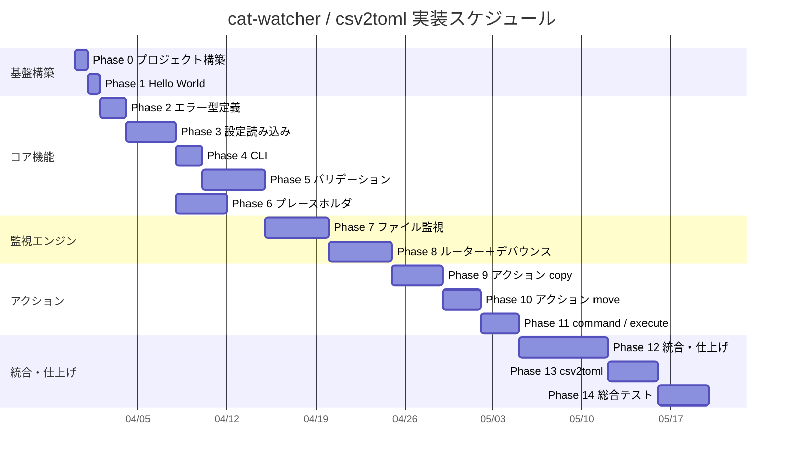

### 5.3 詳細見積もりテーブル

| Phase | 名前 | 学習 | 実装 | テスト | バッファ | **合計(日)** | 難易度 | リスク |
|-------|------|------|------|--------|---------|------------|--------|--------|
| 0 | プロジェクト構築 | 0.5 | 0.5 | — | — | **1** | ★☆☆☆☆ | 低 |
| 1 | Hello World | 0.5 | 0.5 | — | — | **1** | ★☆☆☆☆ | 低 |
| 2 | エラー型定義 | 1 | 0.5 | 0.5 | — | **2** | ★★☆☆☆ | 低 |
| 3 | 設定読み込み | 1 | 1.5 | 1 | 0.5 | **4** | ★★★☆☆ | 中 |
| 4 | CLI | 0.5 | 1 | 0.5 | — | **2** | ★★☆☆☆ | 低 |
| 5 | バリデーション | 1 | 2 | 1.5 | 0.5 | **5** | ★★★★☆ | 高 |
| 6 | プレースホルダ | 0.5 | 2 | 1 | 0.5 | **4** | ★★★☆☆ | 中 |
| 7 | ファイル監視 | 2 | 1.5 | 0.5 | 1 | **5** | ★★★★☆ | 高 |
| 8 | ルーター＋デバウンス | 1 | 2 | 1.5 | 0.5 | **5** | ★★★★☆ | 高 |
| 9 | コピー | 0.5 | 2 | 1 | 0.5 | **4** | ★★★☆☆ | 中 |
| 10 | 移動 | 0.5 | 1.5 | 0.5 | 0.5 | **3** | ★★★☆☆ | 中 |
| 11 | command / execute | 0.5 | 1.5 | 0.5 | 0.5 | **3** | ★★★☆☆ | 中 |
| 12 | 統合・仕上げ | 1 | 3 | 1 | 2 | **7** | ★★★★★ | 最高 |
| 13 | csv2toml | 1 | 2 | 0.5 | 0.5 | **4** | ★★★☆☆ | 中 |
| 14 | 総合テスト | — | 1 | 2 | 1 | **4** | ★★★☆☆ | 中 |
| | | | | | **合計** | **54 日** | | |

### 5.4 工数サマリー

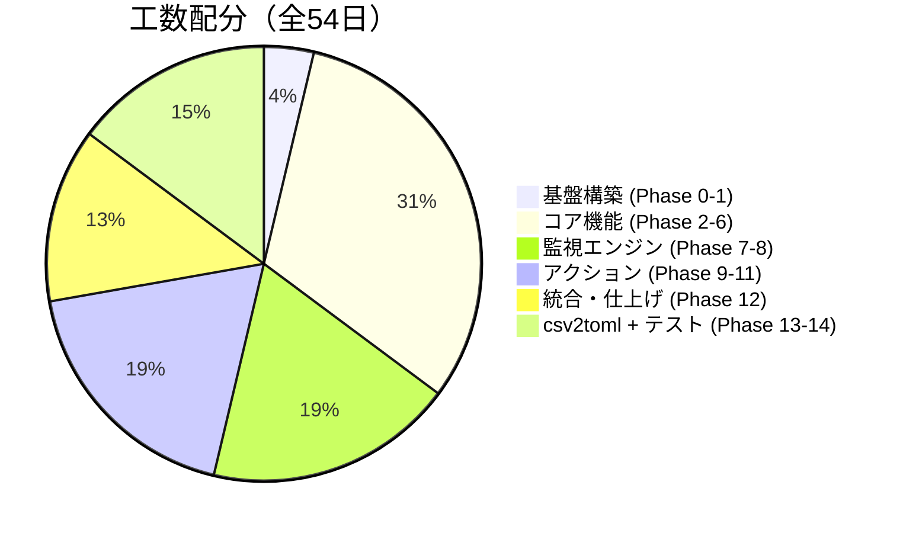

---

## 6. 全体スケジュール

### 6.1 想定スケジュール（3 シナリオ）

| シナリオ | 想定 | 期間 | 完了予定 |
|---------|------|------|---------|
| **楽観** | 学習スムーズ・ハマりなし | 約 40 日 | 2026-05-15 頃 |
| **標準** | 適度にハマる（見積もり通り） | 約 54 日 | 2026-06-01 頃 |
| **悲観** | 所有権/async で大きくハマる | 約 70 日 | 2026-06-20 頃 |

### 6.2 マイルストーン

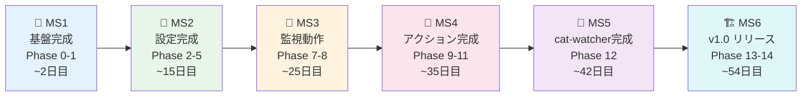

### 6.3 クリティカルパスの可視化

```mermaid
flowchart LR
    P0["Phase 0<br/>1日"] --> P1["Phase 1<br/>1日"]
    P1 --> P2["Phase 2<br/>2日"]
    P2 --> P3["Phase 3<br/>4日"]
    P3 --> P4["Phase 4<br/>2日"]
    P4 --> P5["Phase 5<br/>5日"]
    P3 --> P6["Phase 6<br/>4日"]
    P5 --> P7["Phase 7<br/>5日"]
    P7 --> P8["Phase 8<br/>5日"]
    P8 --> P9["Phase 9<br/>4日"]
    P9 --> P10["Phase 10<br/>3日"]
    P10 --> P11["Phase 11<br/>3日"]
    P11 --> P12["Phase 12<br/>7日"]
    P12 --> P13["Phase 13<br/>4日"]
    P13 --> P14["Phase 14<br/>4日"]
    P6 -.->|"プレースホルダ検証統合"| P5

    style P0 fill:#ffcdd2
    style P1 fill:#ffcdd2
    style P2 fill:#ffcdd2
    style P3 fill:#ffcdd2
    style P4 fill:#ffcdd2
    style P5 fill:#ffcdd2
    style P7 fill:#ffcdd2
    style P8 fill:#ffcdd2
    style P9 fill:#ffcdd2
    style P12 fill:#ffcdd2

    linkStyle 0 stroke:#f44336,stroke-width:3px
    linkStyle 1 stroke:#f44336,stroke-width:3px
    linkStyle 2 stroke:#f44336,stroke-width:3px
    linkStyle 3 stroke:#f44336,stroke-width:3px
    linkStyle 5 stroke:#f44336,stroke-width:3px
    linkStyle 6 stroke:#f44336,stroke-width:3px
    linkStyle 7 stroke:#f44336,stroke-width:3px
    linkStyle 8 stroke:#f44336,stroke-width:3px
```

> 赤いノード＝クリティカルパス上のフェーズ。ここが遅れると全体に影響する。

---

## 7. リスクと対策

### 7.1 技術リスク

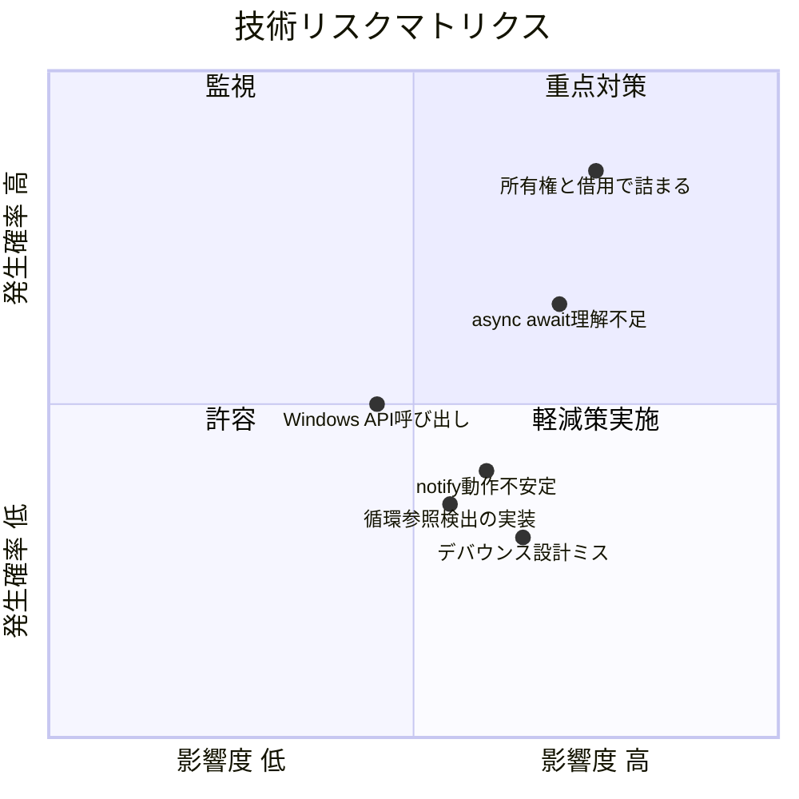

### 7.2 リスク対策表

| リスク | 影響フェーズ | 対策 |
|--------|------------|------|
| 所有権/借用で長期停滞 | Phase 3〜全般 | 公式 Book の該当章を先読み。Clone で逃げてから後でリファクタ |
| async/await の理解不足 | Phase 7〜 | tokio チュートリアルを Phase 6 の間に消化 |
| notify がイベントを取りこぼす | Phase 7-8 | 手動テストスクリプトで早期検証。Rescan 対応を Phase 12 で実装 |
| Phase 12 の肥大化 | Phase 12 | サブタスク（12-A〜12-F）ごとにコミット。必要なら分割ブランチ化 |
| 見積もり超過 | 全般 | 週次で進捗確認。2 倍以上遅れたら計画見直し |

### 7.3 Phase 12 の分割ブランチ（必要に応じて）

Phase 12 は工数が最大のため、膨らんだ場合はサブブランチに分割する。

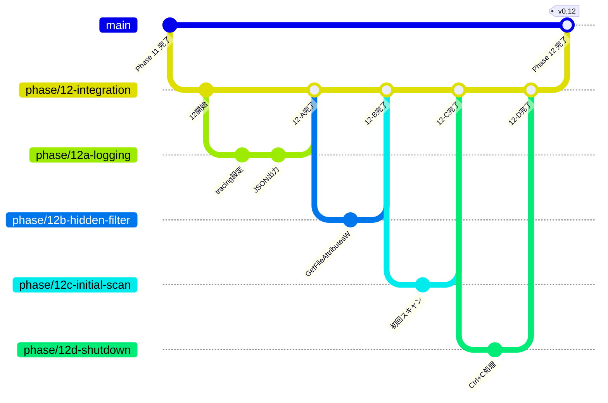

---

## 付録: Git コマンドチートシート

```powershell
# --- フェーズ開始 ---
git checkout main
git pull origin main
git checkout -b phase/N-xxx

# --- 日次作業 ---
git add -A
git commit -m "feat(scope): 説明"
git push origin phase/N-xxx

# --- フェーズ完了 ---
git checkout main
git merge --squash phase/N-xxx
git commit -m "feat: Phase N - 説明"
git tag v0.N
git push origin main --tags
git branch -d phase/N-xxx
git push origin --delete phase/N-xxx
```
